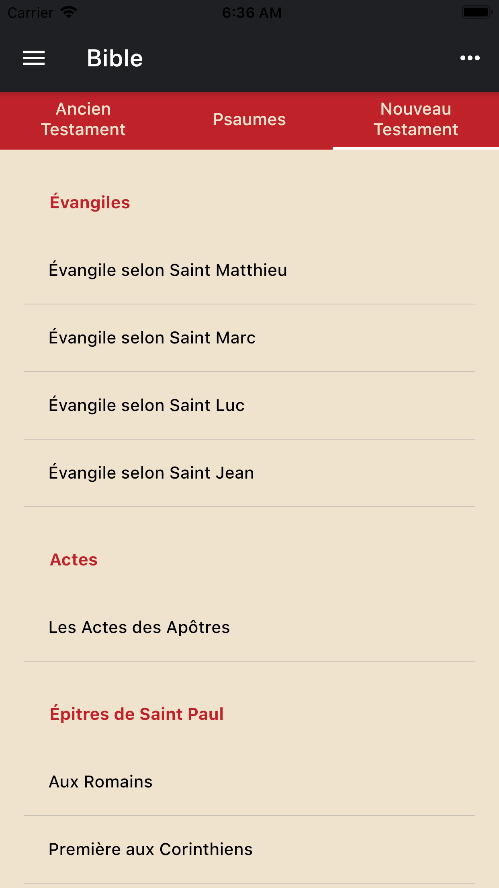
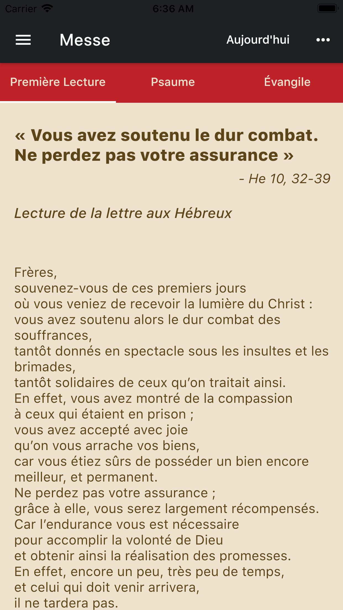
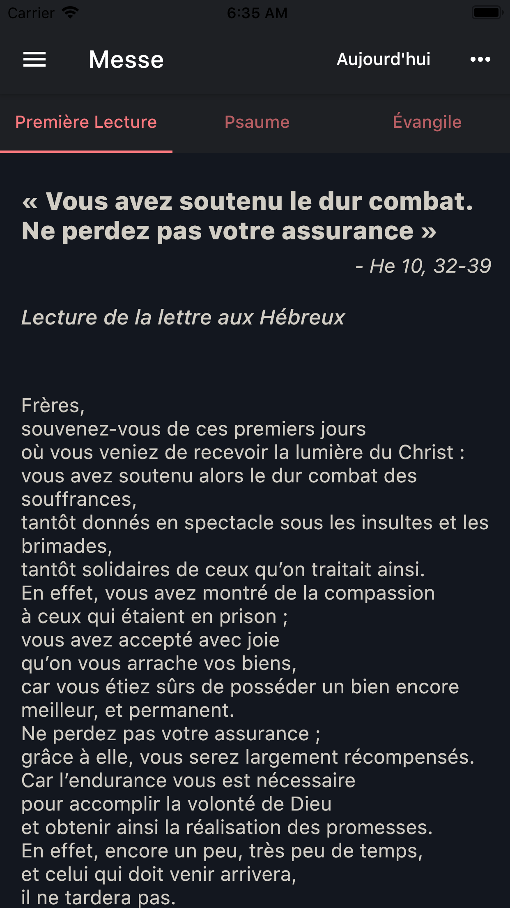

# AELF
:fr: Cette application a pour but de vous donner accès à la Bible et aux lectures du jour (messe et offices de la liturgie des heures) en français selon la traduction officielle pour la liturgie catholique (AELF). Ceci sans être connecté à internet en permanence. Elle est directement inspirée de l'application [AELF pour Android](https://github.com/HackMyChurch/aelf-dailyreadings/)

This application aims to provide you Bible and daily readings in french from AELF.org, without being connected to internet. It is directly inspired by [AELF Android](https://github.com/HackMyChurch/aelf-dailyreadings/)

## Try it ?

You can download it from the iOS AppStore on your iPhone, iPad, or Mac (with M1 CPU) : [Click here to go to the AppStore](https://apps.apple.com/fr/app/aelf/id1498656194?l=fr&ls=1)
To try the next updates on iOS, ask-me and I'll send you a link to download the app from TestFlight ! For Android, I can send you a link to the apk built by Bitrise CI. 

:fr: Vous pouvez la télécharger depuis l'AppSotre sur votre iPhone, iPad ou votre Mac (à processeur M1) : [Cliquer ici pour aller sur l'AppStore](https://apps.apple.com/fr/app/aelf/id1498656194?l=fr&ls=1)
Pour tester les prochaines versions sur iOS, demandez-moi et je vous enverrai un lien pour télécharger l'app depuis TestFlight ! Pour Android je peux vous envoyer le lien vers l'apk compilé par Bitrise CI.
 

 

## Info 
This project is developped in flutter, from scratch and targets at the moment iOS and Android. 
Firstly only the Bible was implemented. Thanks to contributors, we now have mass and liturgy of hours. Contributions are very welcome ! Fell free to open an issue or a merge request. The code is in the **lib** directory. Install flutter, and launch *flutter run* from this directory (using terminal, cmd or powershell...). flutter works very well in Visual Studio Code (VS Code) and IntelliJ.

🇫🇷 Le pojet est actuellement développé de zéro avec flutter, et cible pour le moment iOS et Android. 
Au début seule la Bible était disponible. Mais grace à plusieurs contributeur, nous avons maintenant la messe et la liturgie des heures. Les contributions sont les bienvenues ! Vous pouvez ouvrir un ticket ou une demande de fusion. Le code est dans le dossier **lib**. Installez flutter, et lancer *flutter run* (avec terminal, cmd, ou powershell) depuis le présent dossier. flutter fonctionne aussi dans les IDE Visual Studio Code (VS Code) et IntelliJ (Android Studio).

## Problems, suggestions

🇫🇷 Si vous rencontrer un problème avec l'application AELF, vous pouvez le rapporter ici en créant un ticket (ou issue). Vous pouvez voir aussi la liste des tickets (ou issues), le problème rencontré y figure peut-être déjà. Cliquez sur ce lien : https://gitlab.com/nathanael2/aelf-flutter/-/issues/ Ce système de tickets sert aussi à rapporter les **suggestions** !

If you enconter any bug in the AELF app, you can report it here in an issue. You can also check the issues list, maybe your bug has already been reported. Follow this link : https://gitlab.com/nathanael2/aelf-flutter/-/issues/ This issues system will be also used for ideas and suggestions. 

## TODO

### Bible 
- [X]   Bible offline
- [X]   Bible search
- [-]   Make text selectable, see isue https://gitlab.com/nathanael2/aelf-flutter/-/issues/1
  - [X] Make text selectable in the Bible
  - [ ] Make text selectable in the liturgy

### Daily Readings (mass and liturgy of hours)
- [X]   Basic implementation to start : only today and online
- [X]   Cache a few weeks
- [X]   Date peeker
- [X]   Zone choice
- [ ]   Link readings to the Bible.

### Global 
- [X]   Translate all this Readme to 🇫🇷
- [X]   Publish on iOS AppStore
- [ ]   Improve design for big screens like tablets, see issue : https://gitlab.com/nathanael2/aelf-flutter/-/issues/4 
- [-]   Code cleaning (there is a lot to do here!)
- [ ]   Intent to open aelf.org links in the app
- [ ]   Share button
- [X]   Match the theme and UI from AELF Android.
- [X]   Dark Theme see https://flutter.dev/docs/cookbook/design/themes and https://api.flutter.dev/flutter/material/MaterialApp/darkTheme.html
- [ ]   Improve accessibility (contrast and tweaks for screen readers) see : https://flutter.dev/docs/development/accessibility-and-localization/accessibility 
- [-]   CI with Gitlab.com or Bitrise.io 
- [ ]   Tests see : https://flutter.dev/docs/testing
- [ ]   CD
  - [ ]   Add fastlane for quick release see : https://flutter.dev/docs/deployment/cd 
  - [ ]   Add auto-screenshots : write needed tests and give them to fastlane with https://pub.dev/packages/screenshots 
  - [ ]   Use bitrise.io to manage release
- [ ]   Target others platforms : [Web](https://flutter.dev/web) and [Desktop](https://flutter.dev/desktop)

## Why ?
I started to contribute to the android app [look here](https://github.com/HackMyChurch/aelf-dailyreadings/pull/7) and was looking for a way to provide full offline AELF Bible to iOS users. As I am not a developper, it would have been to difficult for me to developp a native iOS app and to maintain it. When I discovered flutter I thougt it could be a good framework to achieve that. So I gave it a try and it worked : (at the first time of writing) I had a minimal Bible app that runs well on iOS (and Android). Now the app has also the liturgy, and cool features (theme, region choice)...

🇫🇷 J'ai commencé par contribuer à l'application Android AELF [voir ici](https://github.com/HackMyChurch/aelf-dailyreadings/pull/7) et cherchait également un moyen de proposer la Bible AELF (avec accès sans internet) aux utilisateurs d'iOS. N'étant pas développeur, il aurait été trop complexe pour moi de dévelloper une application iOS native et de la maintenir dans le temps. Quand j'ai découvert flutter, je me suis dit que ça pourrait être un bon framework pour ça. Ainsi je me suis lancé, et voilà ça a marché : (au moment où j'ai écris ceci) j'avais une application simple proposant le Bible qui fonctionne sur iOS (et Android). Matinenant il y a la liturgie et de chouettes fonctionnalités (hèmes, choix de la région)...

## Screenshots :

### Bible: 

### Mass: 

### Mass with dark theme:

### Drawer menu: 

